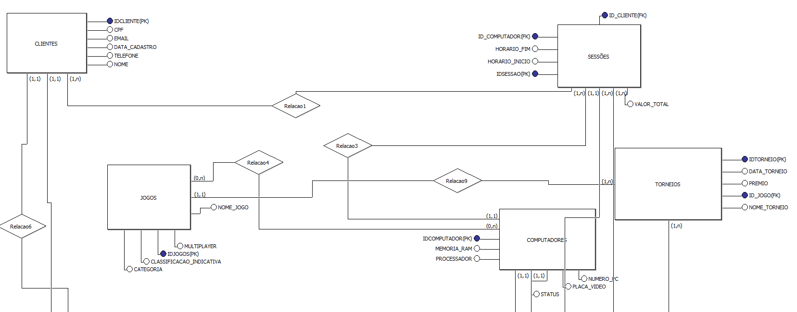
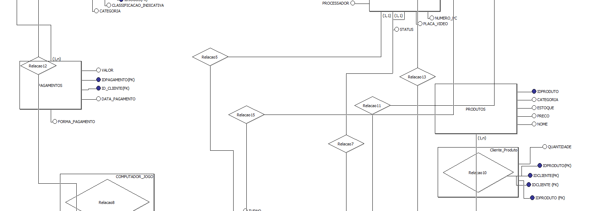
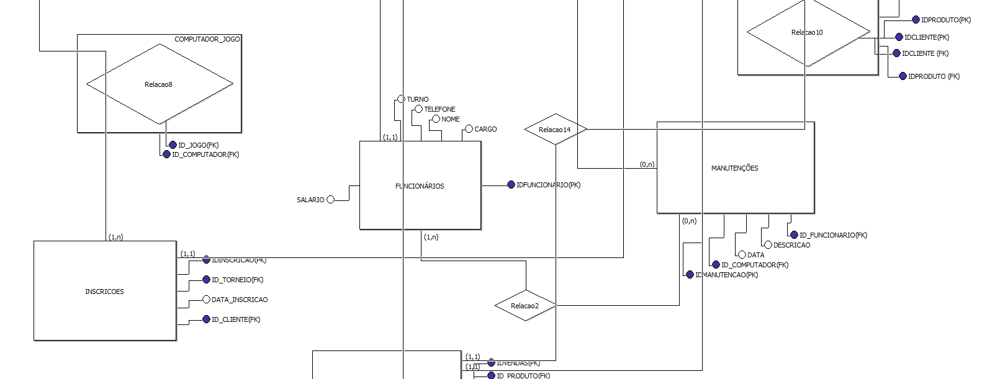
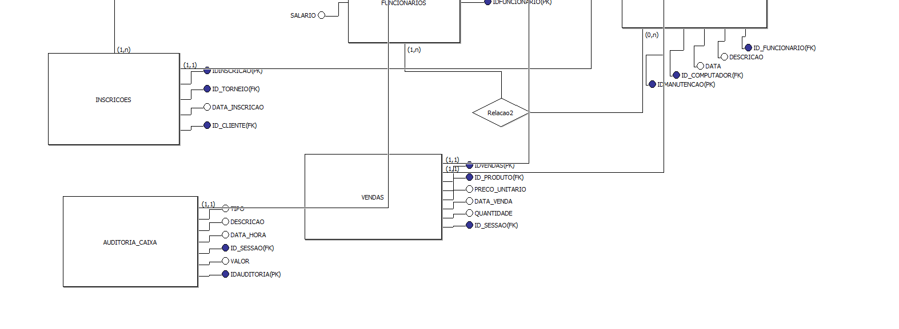

# 🎮 BD_LANHOUSE

Projeto acadêmico de banco de dados para gerenciamento de uma LAN House gamer, desenvolvido em MySQL.

---

## 📌 Sobre o Projeto

O sistema realiza o controle de:

- Clientes
- Sessões de uso
- Computadores
- Jogos instalados
- Pagamentos
- Manutenções

Aplicando conceitos de:

- Modelagem ER
- Relacionamentos
- Normalização
- Chaves primárias e estrangeiras

---

## 🛠️ Tecnologias Utilizadas

- MySQL
- SQL
- Modelagem Entidade-Relacionamento (DER)

---

## 📂 Estrutura do Banco

O banco possui tabelas relacionadas para gerenciamento completo da LAN House.

### Principais entidades:

- clientes
- computadores
- sessoes
- jogos
- pagamentos
- manutencoes

---

# 🧩 Modelo Lógico (DER)

---

## 👨‍💻 Autores

Desenvolvido por Gabriel Ken Kuwabata, Jessé Mendes Da Silva, Rodrigo Henrique Da Silva.
